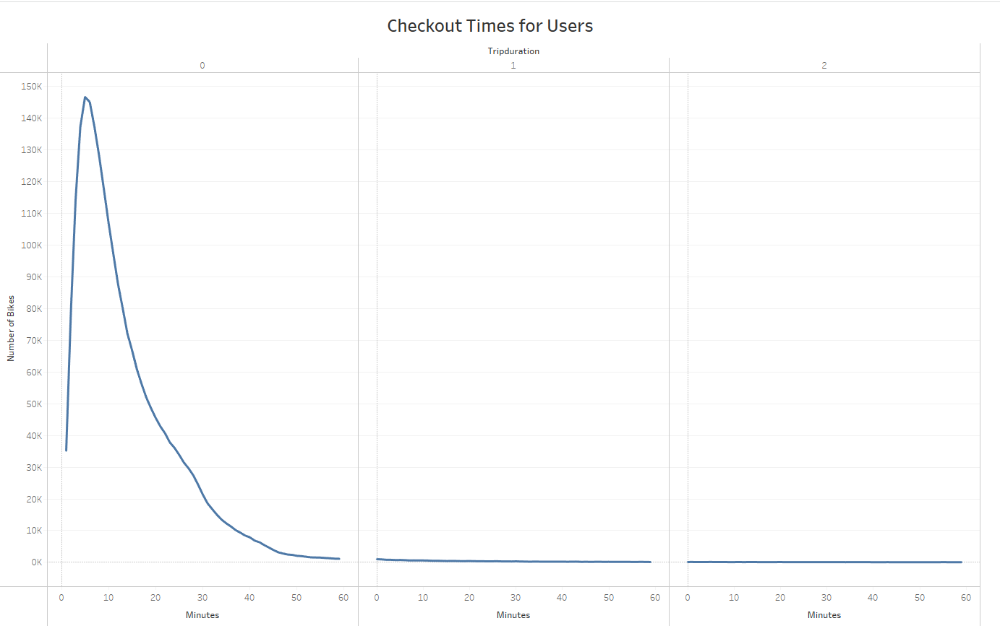
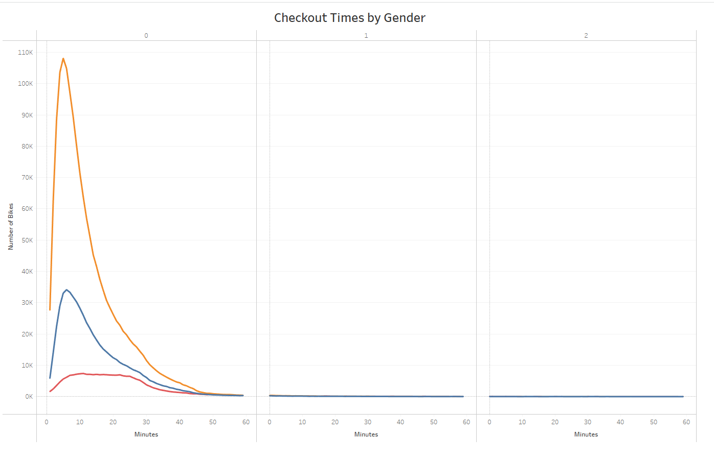
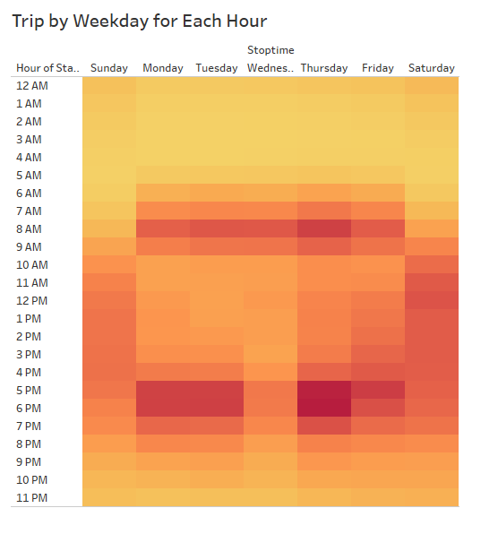
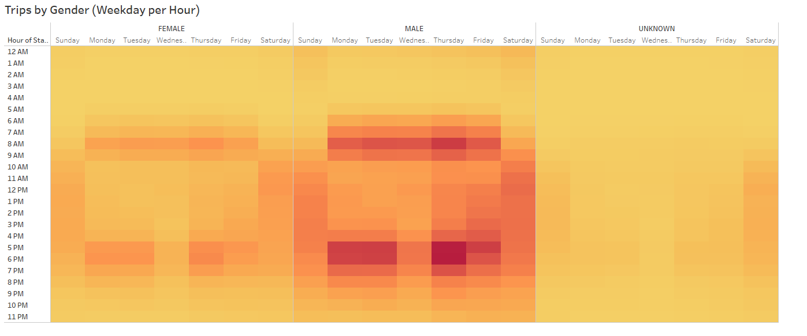
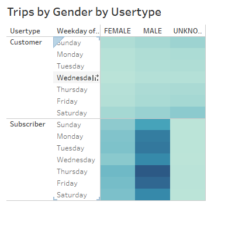

# Citibike Challenge

In this analysis, we use bike trip data to analyze their customer base.

### Trip Duration

# Bike Rentals by Gender

# Heat map trip by weekend hours

# Heat map trips by weekend hours and gender

# Heat map of trips by gender, and subscriber or not

### Summary
With this data, we can see that there are a variety of users for the bike company. There are typically more male users than female users. Popular times for biking tend to be early in the morning and later in the afternoon/early evening. Finally, there are far more male subscribers than any other group of subscriber or customer.